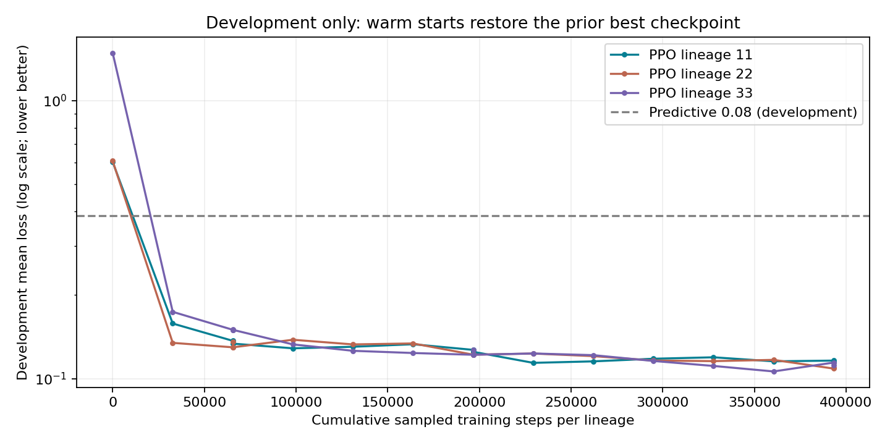
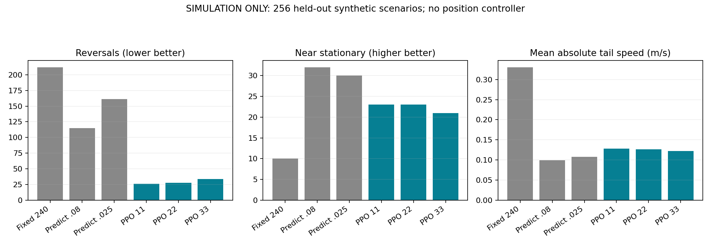

# 离线 PPO 制动训练结果

**训练和验证仅发生在电脑模拟器中；没有接入飞控，没有验证位置接管或实机停点。**

完成 3 轮、3 个独立训练谱系，共 1,179,648 个训练决策步。奖励、随机化范围与开发集保持不变，仅增加训练预算。

主候选为 `ppo_lineage33`，在查看最终测试之前，按开发集平均损失选定。下面同时公布所有谱系，避免只展示最好看的测试结果。

## 256 个未参与调参的合成初态与模型组合

| 方法 | 平均损失↓ | 反向次数↓ | 近静止次数↑ | 低速水平次数↑ | 平均绝对尾速 m/s↓ | 最大回退 cm↓ |
|---|---:|---:|---:|---:|---:|---:|
| fixed_240ms | 2.4090 | 212/256 | 10/256 | 36/256 | 0.3305 | 141.82 |
| ppo_lineage11 | 0.1500 | 26/256 | 23/256 | 179/256 | 0.1282 | 18.18 |
| ppo_lineage22 | 0.1467 | 28/256 | 23/256 | 178/256 | 0.1261 | 14.90 |
| ppo_lineage33 | 0.1557 | 34/256 | 21/256 | 174/256 | 0.1219 | 18.18 |
| predictive_margin_025 | 0.6318 | 161/256 | 30/256 | 93/256 | 0.1078 | 47.01 |
| predictive_margin_080 | 0.4137 | 115/256 | 32/256 | 135/256 | 0.0997 | 39.58 |

主候选对比原预测器：反向 115 → 34；近静止 32 → 21；平均绝对尾速 0.100 → 0.122 m/s。

低损失的来源必须结合上表解释。反向减少而尾速增大，表示选择了更早解除制动的保守取舍，不能称为更准确地停稳。

## 已看过的实测初态回归（之后轨迹仍为模拟）

| 数据组 | 方法 | N | 反向 | 近静止 | 平均绝对尾速 m/s | 最大回退 cm |
|---|---|---:|---:|---:|---:|---:|
| observed_initial_nominal_regression | fixed_240ms | 7 | 7 | 0 | 0.1067 | 20.62 |
| observed_initial_nominal_regression | ppo_lineage11 | 7 | 0 | 0 | 0.1856 | 0.00 |
| observed_initial_nominal_regression | ppo_lineage22 | 7 | 0 | 0 | 0.0999 | 0.00 |
| observed_initial_nominal_regression | ppo_lineage33 | 7 | 0 | 0 | 0.1399 | 0.00 |
| observed_initial_nominal_regression | predictive_margin_025 | 7 | 0 | 2 | 0.0427 | 0.00 |
| observed_initial_nominal_regression | predictive_margin_080 | 7 | 0 | 0 | 0.0942 | 0.00 |
| observed_initial_stress_regression | fixed_240ms | 133 | 112 | 6 | 0.1321 | 48.39 |
| observed_initial_stress_regression | ppo_lineage11 | 133 | 2 | 4 | 0.1660 | 2.19 |
| observed_initial_stress_regression | ppo_lineage22 | 133 | 12 | 15 | 0.0957 | 5.53 |
| observed_initial_stress_regression | ppo_lineage33 | 133 | 3 | 13 | 0.1228 | 0.80 |
| observed_initial_stress_regression | predictive_margin_025 | 133 | 54 | 20 | 0.0705 | 19.92 |
| observed_initial_stress_regression | predictive_margin_080 | 133 | 23 | 20 | 0.0900 | 12.11 |

## 边界与下一步

- 合成测试是同一分布的新随机样本，不是新的飞行数据，也不是已确认的实机误差边界。
- 实测初态回归中原来就有较丰富的过去命令；训练初态的过去命令均为水平。这种分布差异需要明确处理，不能把回归表现解释成实机保证。
- 动作只有继续20度反向制动或不可逆回水平；已经来不及止住残余姿态的状态，策略没有正向纠正动作。
- 每种方法回水平后观察1.5秒；近静止要求从制动起全程未反向，且最后100ms速度≤0.04m/s、倾角≤3°、角速度≤5°/s。低速水平状态的速度上限为0.20m/s。两者都不代表长期位置保持。
- 本阶段没有位置目标，因此不报告虚假的目标停点误差或声称 coast 终点控制已经完成。
- 最终测试一旦被用于改进下一版，就应归入开发资料；下一版另留独立测试。

下一轮优先修正离线任务，而不是直接延长训练：覆盖实测的命令历史与双向运动；把 coast 终点、剩余距离和位置接管纳入模型与观测；同时评估停点误差、残余速度和回退。当前模拟结果不支持直接接入飞控。

## 文件

- `selection.json`：查看最终测试前冻结的检查点选择、哈希与开发分数。
- 各 `round*_seed*/model_best.zip`：仅供离线加载的模型。
- `final_evaluation/report.json`：所有配对指标；`manifest.json` 保存输入、模型和源码哈希。
- `environment-freeze.txt`：本机安装版本；`PLAN.md`：预先约定的实验范围与指标。
- `loop-results.tsv`、`handoff.json`：有界迭代记录。

- `verification.md`：测试结果、来源核对和实验边界。

